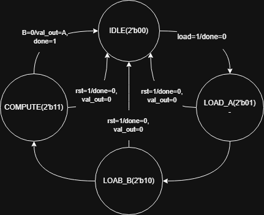

# Mealy FSM GCD Calculator

This project implements a Mealy Finite State Machine (FSM) in Verilog to compute the Greatest Common Divisor (GCD) of two 8-bit integers using the Euclidean algorithm. The design was developed and simulated in Vivado 2016.4, targeting a Zybo FPGA.

## Project Overview
- **Objective**: Compute the GCD of two 8-bit numbers using a Mealy FSM.
- **Tools**: Vivado 2016.4, Verilog, Zybo FPGA.
- **Features**:
  - Four-state FSM: IDLE, LOAD_A, LOAD_B, COMPUTE.
  - Handles inputs via a `load` signal and 8-bit `val_in`.
  - Outputs GCD via 8-bit `val_out` and a `done` flag.
- **Test Cases**: Verified with pairs (8,20)=4, (18,45)=9, (28,49)=7.

## Repository Structure
- `src/`: Verilog source (`GCD_Mealy.v`) and testbench (`simple_tb.sv`).
- `docs/`: Lab report (`ECE_440_Lab_1_Report.pdf`).
- `images/`: Simulation screenshots and state diagram.

## State Diagram


## How to Run
1. Clone the repository:
   ```bash
   git clone https://github.com/TWi5td/gcd-mealy-fsm.git
